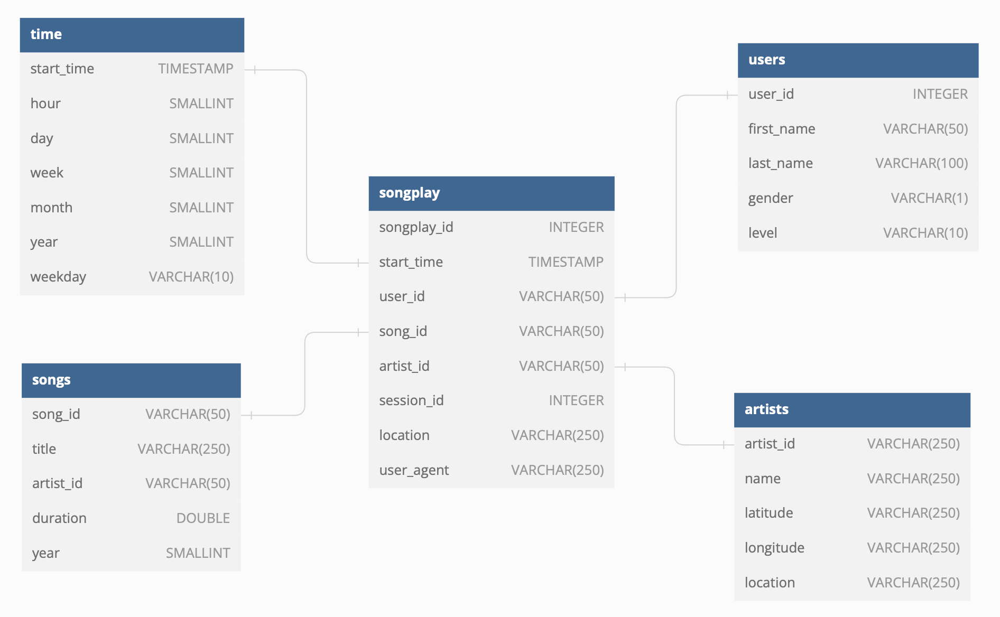

Sparkify Data Warehouse
---
Infrastructure as Code (IaC) that implements Sparkify Data Warehouse in an Amazon Redshift cluster and ETL scripts that
load the data from an S3 source to Redshift.

# About the Data Warehouse
This data warehouse provides our analytics team an optimized way to generate insights, offering trusted and easily 
available data. It stores data about the songs available on our platform and how our users consume it.

### About the Database schemas
The database design follows the concept of a star schema, provided below:



The star schema is one of the simplest data warehouse schemas and consists of one or more fact tables and any number of
dimension tables, according to [Wikipedia](https://en.wikipedia.org/wiki/Star_schema). The design was chosen to simplify
the analyst's queries while maintaining a schema that provides fast write and read operations using a low number of
`JOIN` statements.

This data warehouse is build around one fact table, `songplay`, which stores the events of users playing songs, and four
dimension tables `time, artists, users, songs` which stores information related to the time when the event performed,
about the artists (e.g. name and location), users (e.g. name, gender and account level) and songs (e.g. title, 
artist_id and duration), respectively.

### About the ELT pipeline

The pipeline extracts data from an S3 bucket containing all events and songs raw data. The data is then loaded to 
`staging_events and staging_songs` staging tables on Redshift using a SQL `COPY` statement. Finally, data is transformed
according to the final tables star schema using SQL statements.

The ELT method was chosen over ETL in order to leverage our operation speed using SQL language to transform data 
previously loaded into the Warehouse while also reducing expenses by avoiding executing AWS Lambda functions to 
transform data before loading it to Redshift.

# Quick Start

## Install

Before deploying the resources or executing ETL jobs you need to install `boto3`, `pandas` and `psycopg2`.

```bash
pip install boto3, pandas, psycopg2
```

## Creating the resources

Then on [dwh.cfg](dwh.cfg) set a database password in `DB_PASSWORD` and provide your AWS
credentials on the `[AWS]` section.

Run [create_aws_resources.py](create_aws_resources.py) to create the IAM role, Redshift cluster and configure the
connections to the database. If any of this is done, the script will
ignore it and proceed to the next step.

```bash
python ./create_aws_resources.py
```

## Creating tables and running the initial ETL operation

When all resources are created and the cluster is available, create the tables by running 
[create_tables.py](create_tables.py).

```bash
python ./create_tables.py
```

Then run the first ETL operation.

```bash
python ./etl.py
```

# Sample queries

You can find and execute sample SQL queries on [sample queries.ipynb](sample_queries.ipynb). Queries on the file are
able to answer two business questions: 
- What were the top 10 songs played in 2018;
- What were the top 10 artists played in 2018.
